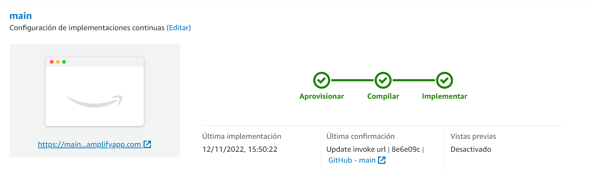
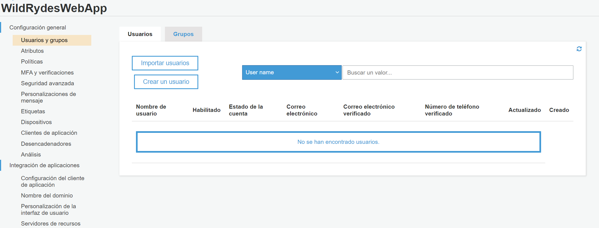
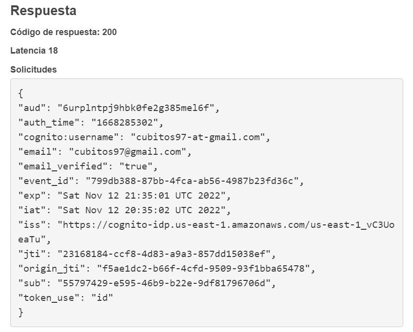
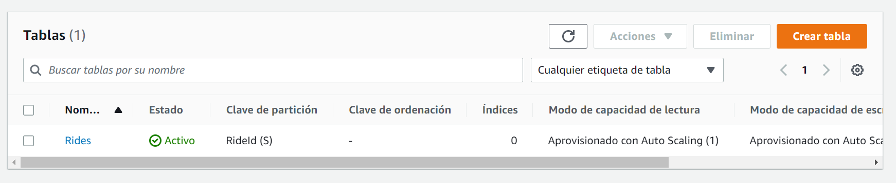
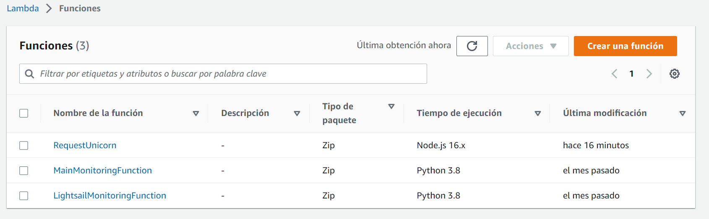
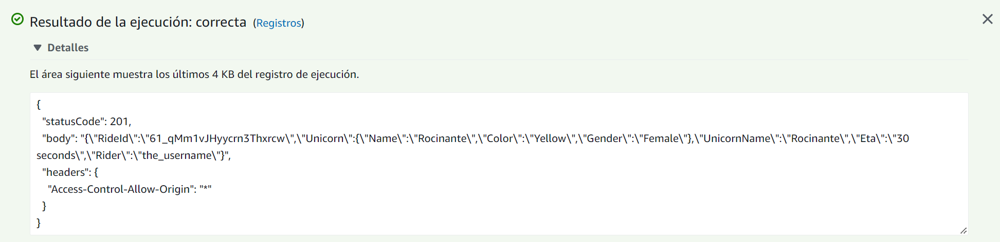
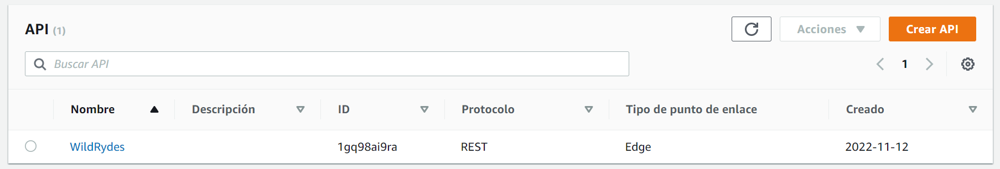
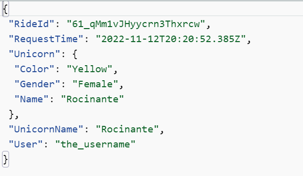
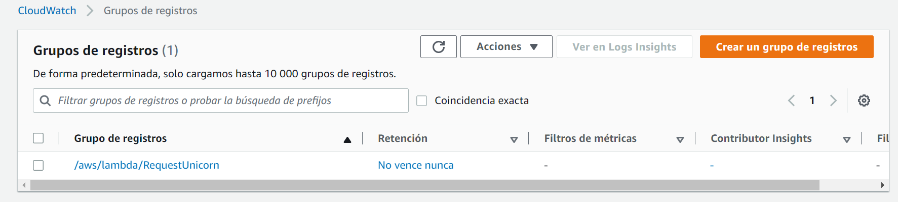
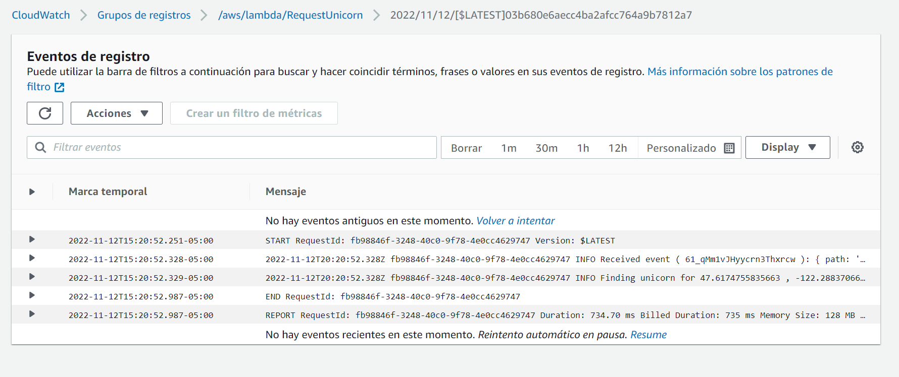

# AYGO-AWS_Serverless_Application_Model

<strong>Modulo 1 - Alojar un sitio web estatico</strong>
 
Despliegue de la aplicacion wildrides-syte en amplify desde GitHub

<strong>Modulo 2 - Administrar usuarios</strong>
 
Creación de usuarios en cognito

Prueba de token en cognito

<strong>Modulo 3 - Backend sin servidor</strong>

Creación de la tabla Rides

Despliegue de la función RequestUnicorn

Resultado del la prueba a la lambda

<strong>Modulo 4 - API RESTFUL</strong>

Despliegue del API wildrides

<strong>Prueba</strong>

Al utilizar la aplicación se evidencio la creación de un item en la tabla Rides de dynamo

A través de Cloud Watch se evidencia el registro que genero al hacer pedir un unicornio

